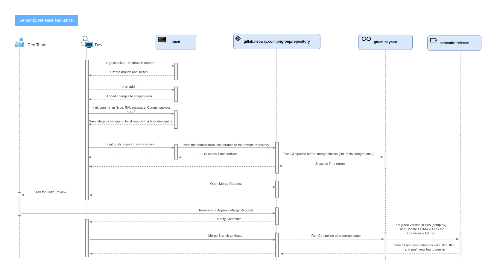

# semantic-release

This project aims to automatically upgrade the release version based on git tags and commit messages.



## Why

It is a way of programming complexity abstraction. So the programmers do not have to update the release versions manually on CHANGELOG.md, setup.py files, generate and push git tags.
This project does this work automatically.

## How

Clone this project, generate and push its image:

Generating the image.
```
make image
```

Before pushing it to your registry, you must login to the docker registry.
Note: Replace [] with the correct credentials and registry DNS.

```
docker login -u [username] -p [password] [registry.server.com]
```

Push the image to the registry.
```
docker push neowaylabs/semantic-release:[version]
```

Now, you can use it in your CI files.

The semantic release Docker image can be called within a `.gitlab-ci.yml` file, git hub action, or travis ci Continuous Integration (CI) stage as follows.

```yaml
stages:
  - semantic-release

semantic-release:
    stage: semantic-release
    only:
        refs:
            - master
    before_script: 
        - docker pull registry.com/dataplatform/semantic-release:latest
    script:
        - docker run registry.com/dataplatform/semantic-release:latest up -git-host ${CI_SERVER_HOST} -git-group ${CI_PROJECT_NAMESPACE} -git-project ${CI_PROJECT_NAME} -username ${PPD2_USERNAME} -password ${PPD2_ACCESS_TOKEN}

```

Also, you can add `-changelog "true"` argument to set semantic-release to get most recent version from CHANGELOG.md file instead of get it from gitlab tags.

If your project is a Python project you can add the flag `-setup-py true` to update the release version in this file too.

Note: The version must be placed in a variable called `__version__` as follows:

```py
from setuptools import setup, find_packages

__version__ = "1.0.0"
with open("README.md") as description_file:
    readme = description_file.read()

with open("requirements.txt") as requirements_file:
    requirements = [line for line in requirements_file]

setup(
    name="helloworld",
    version=__version__,
    author="dataplatform",
    python_requires=">=3.8.5",
    description="A sample project to test semantic-release automations.",
    long_description=readme,
    url="https://gitlab.com.br/group/py_project",
    install_requires=requirements,
    packages=find_packages(),
)
```

 ### If you need more information about the semantic release CLI usage you can run the following command.

```
docker run registry.com/group/semantic-release help
```

### If you want to check the commit tags you can use in your commit message run the following command.

```
docker run registry.com/group/semantic-release help-cmt
```

So the semantic release can find out the commit type to define the upgrade type (MAJOR, MINOR or PATCH), and the message to write to CHANGELOG.md file, one must follow the commit message pattern bellow:


```
type: [type here].
message: Commit message here.
```

I.e.
```
type: [feat]
message: Added new function to print the Fibonacci sequece.
```

### If you want to complete a Merge Request without triggering the versioning process then you can use one of the skip type tags as follows.

- type: [skip]
- type: [skip v]
- type: [skip versioning]

## Adding new tests

Add new integration tests if you make a change that needs to interact with a repository. Here are the steps you need to follow to add further integration tests:

1. Run:

```
make env
```

This will run a container with a full GitLab. Wait for GitLab to be accessible through the browser.

Address: https://localhost:443

2. Run:

```
make gitlab-restore
```

This will restore all GitLab repos. After GitLab is accessible again, log in and create the new test scenario.

user: root
password: password

3. Run:

```
make gitlab-backup
```

This will create a new backup with all the changes you implemented. A new file will be added to `srv/gitlab/backups`. Remember to add this new file in a commit and in the MR to able versioning.

## Testing

Run:

```
make check
```
Open generated coverage on a browser:

```
make coverage
```
To perform static analysis:

```
make static-analysis
```

## Integration Tests

Run the integration tests as soon as the gitlab container is available:
```
make check-integration
```

You can manually remove the gitlab container running the following command:
```
make env-stop
```

## Local Running
You can also run the application locally by running the following commands:

Create a go binary file and run it:
```
make run-local
```

## Releasing

Run:

```
make release version=<version>
```

It will create a git tag with the provided **<version>**
and build and publish a docker image.

## Git Hooks

To install the project githooks run:

```
make githooks
```
